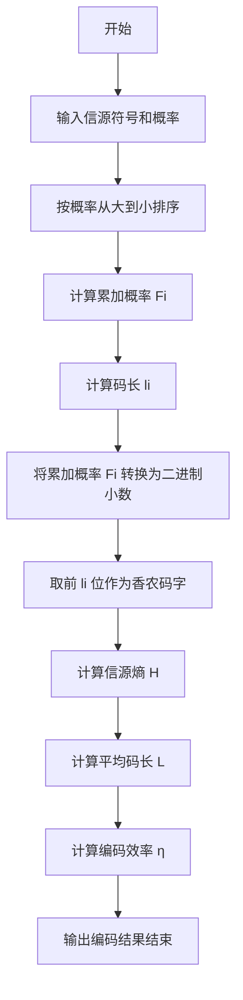
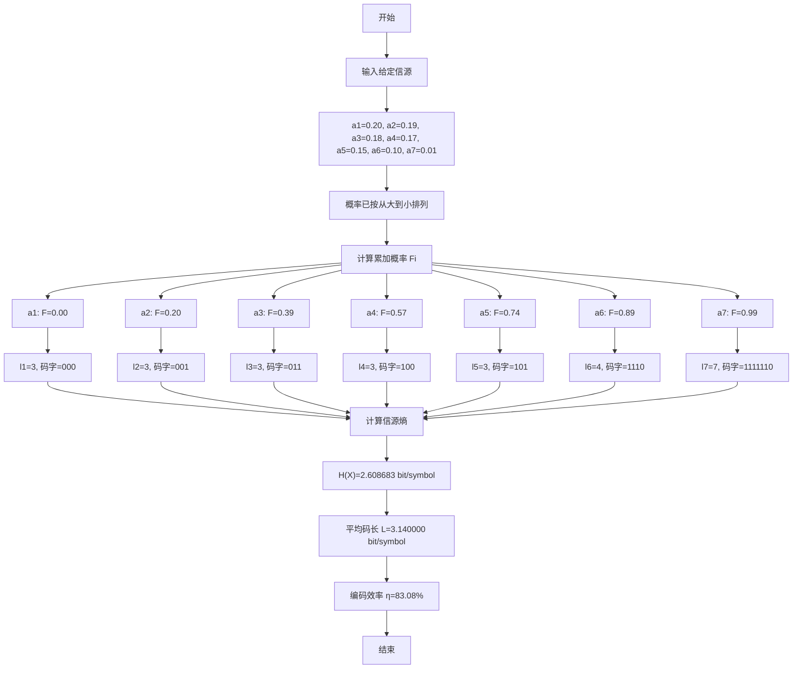
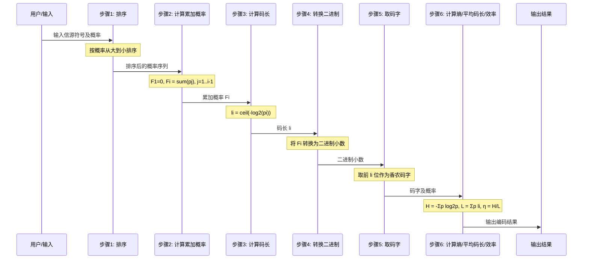
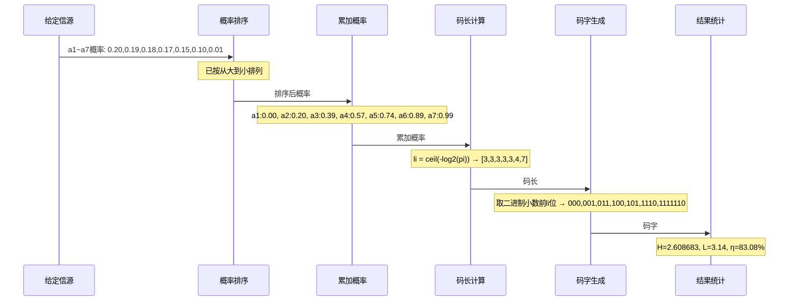
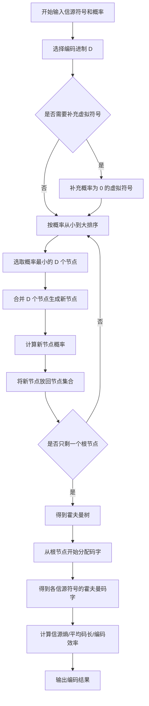
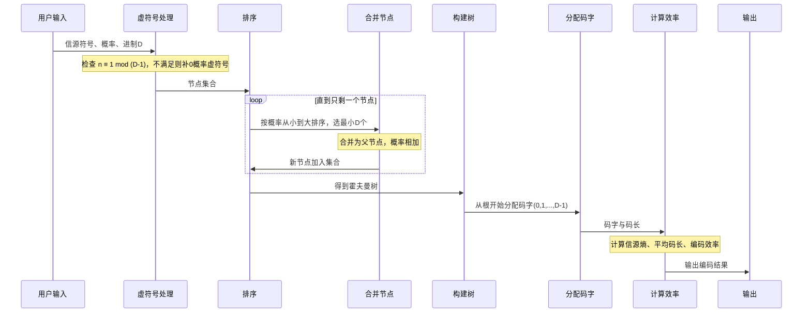
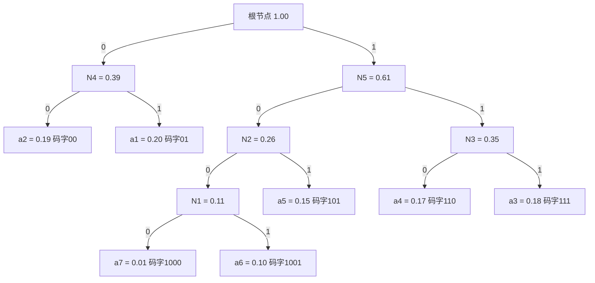
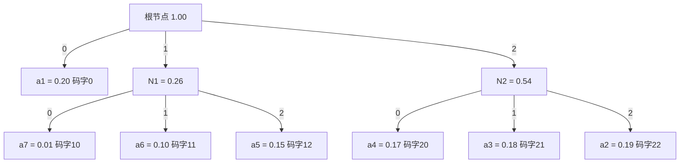

#### **信源熵的计算和函数曲线绘制** 

1. 掌握熵函数表达式及其性质，实现信源熵的计算；  

2. 掌握 MATLAB 绘图函数，分别编程绘制二元、三元熵函数曲线； 

3. 实现以下功能：  

   输入：一篇英文字母组成的信源文档  

   输出：给出该信源文档的中各个字母与空格的概率分布，以及该信源的熵 


熵函数基本公式为：
$$
H(X)=-\sum_{i=1}^{n}p_i\log_2 p_i
$$
二元信源熵为：
$$
H(p)=-p\log_2p-(1-p)\log_2(1-p)
$$
三元信源熵为：
$$
H(p_1,p_2,p_3) =-p_1\log_2p_1-p_2\log_2p_2-p_3\log_2p_3
$$
且：$p_1+p_2+p_3=1$


```matlab
clc;
clear;
close all;

%  一、绘制二元熵函数曲线
%  H(p) = -p log2(p) - (1-p) log2(1-p)

p = 0:0.001:1;

H2 = zeros(size(p));

for i = 1:length(p)
    if p(i) == 0 || p(i) == 1
        H2(i) = 0;
    else
        H2(i) = -p(i)*log2(p(i)) - (1-p(i))*log2(1-p(i));
    end
end

figure;
plot(p, H2, 'LineWidth', 2);
grid on;
xlabel('p');
ylabel('H(p)');
title('二元信源熵函数曲线');


%  二、绘制三元熵函数曲面
%  H(p1,p2,p3) = -sum(pi log2 pi)
%  其中 p3 = 1 - p1 - p2

step = 0.01;
p1 = 0:step:1;
p2 = 0:step:1;

[P1, P2] = meshgrid(p1, p2);
P3 = 1 - P1 - P2;

H3 = zeros(size(P1));

for i = 1:size(P1, 1)
    for j = 1:size(P1, 2)
        if P3(i, j) >= 0
            probs = [P1(i, j), P2(i, j), P3(i, j)];
            H_temp = 0;

            for k = 1:3
                if probs(k) > 0
                    H_temp = H_temp - probs(k) * log2(probs(k));
                end
            end

            H3(i, j) = H_temp;
        else
            H3(i, j) = NaN;
        end
    end
end

figure;
surf(P1, P2, H3);
shading interp;
grid on;
xlabel('p_1');
ylabel('p_2');
zlabel('H(p_1,p_2,p_3)');
title('三元信源熵函数曲面');


%  三、统计英文文档中字母与空格概率分布及信源熵

filename = 'source.txt';

fid = fopen(filename, 'r');

if fid == -1
    error('无法打开文件，请确认 source.txt 是否在当前工作目录下。');
end

text = fread(fid, '*char')';
fclose(fid);

% 转换为小写
text = lower(text);

% 统计对象：26 个英文字母 + 空格
symbols = ['a':'z', ' '];
counts = zeros(1, length(symbols));

% 统计频数
for i = 1:length(text)
    ch = text(i);

    for j = 1:length(symbols)
        if ch == symbols(j)
            counts(j) = counts(j) + 1;
            break;
        end
    end
end

% 总符号数
total_count = sum(counts);

if total_count == 0
    error('文档中没有英文字母或空格。');
end

% 计算概率分布
probabilities = counts / total_count;

% 计算信源熵
H_source = 0;

for i = 1:length(probabilities)
    if probabilities(i) > 0
        H_source = H_source - probabilities(i) * log2(probabilities(i));
    end
end

% 输出统计结果

fprintf('\n英文信源文档统计结果\n');
fprintf('总符号数：%d\n\n', total_count);

fprintf('符号\t频数\t 概率\n');
fprintf('-----------------------------\n');

for i = 1:length(symbols)
    if symbols(i) == ' '
        fprintf('空格\t%d\t%.6f\n', counts(i), probabilities(i));
    else
        fprintf('%c\t %d\t %.6f\n', symbols(i), counts(i), probabilities(i));
    end
end

fprintf('\n该信源的熵 H = %.6f bit/symbol\n', H_source);

% 绘制概率分布柱状图

figure;

bar(probabilities);
grid on;

xticks(1:length(symbols));

symbol_labels = cell(1, length(symbols));
for i = 1:length(symbols)
    if symbols(i) == ' '
        symbol_labels{i} = 'space';
    else
        symbol_labels{i} = symbols(i);
    end
end

xticklabels(symbol_labels);

xlabel('符号');
ylabel('概率');
title('英文信源中字母与空格的概率分布');
```


```
===== 英文信源文档统计结果 =====
总符号数：58

符号	频数	 概率
-----------------------------
a	 3	 0.051724
b	 0	 0.000000
c	 0	 0.000000
d	 1	 0.017241
e	 6	 0.103448
f	 2	 0.034483
g	 1	 0.017241
h	 2	 0.034483
i	 5	 0.086207
j	 0	 0.000000
k	 1	 0.017241
l	 2	 0.034483
m	 2	 0.034483
n	 4	 0.068966
o	 6	 0.103448
p	 2	 0.034483
q	 0	 0.000000
r	 3	 0.051724
s	 3	 0.051724
t	 3	 0.051724
u	 0	 0.000000
v	 0	 0.000000
w	 2	 0.034483
x	 1	 0.017241
y	 1	 0.017241
z	 0	 0.000000
空格	8	0.137931

该信源的熵 H = 4.036451 bit/symbol


```


#### **二进制香农编码**  

1. 总结香农编码的基本步骤，画出程序流程图；  

2. 给定以下信源，实现香农编码的 Matlab 源程序。  

   对给定信源进行二进制香农编码，通过 MATLAB 进行编码过程仿真，并计算平均码长及编码效率。 

$$
\begin{bmatrix}
X \\
P(X)
\end{bmatrix}
=
\begin{bmatrix}
a_1 & a_2 & a_3 & a_4 & a_5 & a_6 & a_7 \\
0.2 & 0.19 & 0.18 & 0.17 & 0.15 & 0.1 & 0.01
\end{bmatrix}
$$


```
clc;
clear;
close all;

% 实验二：二进制香农编码

% 信源符号
symbols = {'a1','a2','a3','a4','a5','a6','a7'};

% 信源概率
P = [0.2 0.19 0.18 0.17 0.15 0.1 0.01];

% 按概率从大到小排序
[P_sort, index] = sort(P, 'descend');
symbols_sort = symbols(index);

n = length(P_sort);

% 计算码长 li = ceil(-log2(pi))
L = ceil(-log2(P_sort));

% 计算累加概率 Fi
F = zeros(1, n);
for i = 2:n
    F(i) = F(i-1) + P_sort(i-1);
end

% 生成香农编码
codes = cell(1, n);

for i = 1:n
    temp = F(i);
    code = '';

    for j = 1:L(i)
        temp = temp * 2;

        if temp >= 1
            code = [code '1'];
            temp = temp - 1;
        else
            code = [code '0'];
        end
    end

    codes{i} = code;
end

% 计算信源熵
H = 0;
for i = 1:n
    H = H - P_sort(i) * log2(P_sort(i));
end

% 计算平均码长
L_avg = sum(P_sort .* L);

% 计算编码效率
eta = H / L_avg;

% 输出结果

fprintf('二进制香农编码结果\n\n');

fprintf('%-7s %-8s %-9s %-7s %-10s\n', ...
    '符号', '概率', '累加概率', '码长', '码字');
fprintf('------------------------------------------------------\n');

for i = 1:n
    fprintf('%-8s %-10.2f %-12.2f %-8d %-10s\n', ...
        symbols_sort{i}, P_sort(i), F(i), L(i), codes{i});
end

fprintf('\n信源熵 H(X)    = %.6f bit/symbol\n', H);
fprintf('平均码长 L     = %.6f bit/symbol\n', L_avg);
fprintf('编码效率 η     = %.2f%%\n', eta * 100);
```


```


实验运行结果

二进制香农编码结果

符号      概率       累加概率      码长      码字        
------------------------------------------------------
a1       0.20       0.00         3        000       
a2       0.19       0.20         3        001       
a3       0.18       0.39         3        011       
a4       0.17       0.57         3        100       
a5       0.15       0.74         3        101       
a6       0.10       0.89         4        1110      
a7       0.01       0.99         7        1111110   

信源熵 H(X)    = 2.608683 bit/symbol
平均码长 L     = 3.140000 bit/symbol
编码效率 η     = 83.08%
```


二进制香农编码的基本步骤

二进制香农编码是一种基于信源符号概率分布的变长编码方法。其基本思想是：概率越大的符号分配较短的码字，概率越小的符号分配较长的码字，从而降低平均码长，提高编码效率。

设信源符号为：

$$
X=\{a_1,a_2,\cdots,a_n\}
$$

对应的概率分布为：

$$
P=\{p_1,p_2,\cdots,p_n\}
$$

二进制香农编码的基本步骤如下：

1. 将信源符号按照概率从大到小进行排序；

2. 计算每个信源符号的累加概率：

   $$
   F_i=\sum_{j=1}^{i-1}p_j
   $$

   其中，第一个符号的累加概率为：

   $$
   F_1=0
   $$

3. 根据每个符号的概率计算对应码长：

   $$
   l_i=\lceil -\log_2 p_i \rceil
   $$

4. 将累加概率 $F_i$ 转换为二进制小数；

5. 取二进制小数点后的前 $l_i$ 位作为该符号的香农码字；

6. 计算信源熵：

   $$
   H(X)=-\sum_{i=1}^{n}p_i\log_2p_i
   $$

7. 计算平均码长：

   $$
   \overline{L}=\sum_{i=1}^{n}p_i l_i
   $$

8. 计算编码效率：

   $$
   \eta=\frac{H(X)}{\overline{L}}\times 100\%
   $$

---

二进制香农编码程序流程图












#### **二进制和三进制霍夫曼编码**  

1. 总结二进制霍夫曼编码的基本步骤，画出程序流程图；  

2.  给定以下信源，实现霍夫曼编码的 Matlab 源程序。  

   对给定信源进行二进制和三 进制霍夫曼编码，通过 MATLAB 进行编码过程仿真，并计算平均码长及编码效率。 

$$
\begin{bmatrix}
X \\
P(X)
\end{bmatrix}
=
\begin{bmatrix}
a_1 & a_2 & a_3 & a_4 & a_5 & a_6 & a_7 \\
0.2 & 0.19 & 0.18 & 0.17 & 0.15 & 0.1 & 0.01
\end{bmatrix}
$$


```
clc;
clear;
close all;

% 实验三：二进制和三进制霍夫曼编码

% 信源符号
symbols = {'a1','a2','a3','a4','a5','a6','a7'};

% 信源概率
P = [0.2 0.19 0.18 0.17 0.15 0.1 0.01];

%% 计算二进制霍夫曼编码

[codes2, len2, process2] = huffman_code(symbols, P, 2);

% 信源熵，单位 bit/symbol
H2 = -sum(P .* log2(P));

% 二进制平均码长，单位 bit/symbol
L_avg2 = sum(P .* len2);

% 二进制编码效率
eta2 = H2 / L_avg2;

%% 计算三进制霍夫曼编码

[codes3, len3, process3] = huffman_code(symbols, P, 3);

% 三进制信源熵，单位 trit/symbol
H3 = H2 / log2(3);

% 三进制平均码长，单位 trit/symbol
L_avg3 = sum(P .* len3);

% 三进制编码效率
eta3 = H3 / L_avg3;

%% 输出二进制霍夫曼编码过程

fprintf('二进制霍夫曼编码合并过程\n\n');

for i = 1:length(process2)
    fprintf('第%-2d次合并：%-35s 合并后概率 = %.2f\n', ...
        i, process2(i).items, process2(i).weight);
end

fprintf('\n二进制霍夫曼编码结果\n\n');
fprintf('%-7s %-8s %-10s %-8s\n', '符号', '概率', '码字', '码长');
fprintf('----------------------------------------\n');

for i = 1:length(symbols)
    fprintf('%-8s %-10.2f %-12s %-8d\n', ...
        symbols{i}, P(i), codes2{i}, len2(i));
end

fprintf('\n信源熵 H(X)        = %.6f bit/symbol\n', H2);
fprintf('二进制平均码长 L   = %.6f bit/symbol\n', L_avg2);
fprintf('二进制编码效率 η   = %.2f%%\n', eta2 * 100);

%% 输出三进制霍夫曼编码过程

fprintf('\n\n三进制霍夫曼编码合并过程\n\n');

for i = 1:length(process3)
    fprintf('第%-2d次合并：%-35s 合并后概率 = %.2f\n', ...
        i, process3(i).items, process3(i).weight);
end

fprintf('\n三进制霍夫曼编码结果\n\n');
fprintf('%-7s %-8s %-10s %-8s\n', '符号', '概率', '码字', '码长');
fprintf('----------------------------------------\n');

for i = 1:length(symbols)
    fprintf('%-8s %-10.2f %-12s %-8d\n', ...
        symbols{i}, P(i), codes3{i}, len3(i));
end

fprintf('\n信源熵 H(X)        = %.6f bit/symbol\n', H2);
fprintf('三进制信源熵 H3(X) = %.6f trit/symbol\n', H3);
fprintf('三进制平均码长 L   = %.6f trit/symbol\n', L_avg3);
fprintf('三进制编码效率 η   = %.2f%%\n', eta3 * 100);


% D 进制霍夫曼编码函数

function [codes, lengths, process] = huffman_code(symbols, P, D)

    n = length(P);

    % 初始化码字
    codes = cell(1, n);
    for i = 1:n
        codes{i} = '';
    end

    % 判断是否需要补充虚符号
    padNum = mod((D - 1) - mod(n - 1, D - 1), D - 1);

    % 初始化节点
    nodes = struct('prob', {}, 'index', {}, 'name', {});

    for i = 1:n
        nodes(i).prob = P(i);
        nodes(i).index = i;
        nodes(i).name = symbols{i};
    end

    % 补充概率为 0 的虚符号
    for i = 1:padNum
        nodes(n + i).prob = 0;
        nodes(n + i).index = [];
        nodes(n + i).name = ['dummy' num2str(i)];
    end

    process = struct('items', {}, 'weight', {});

    step = 0;

    % 霍夫曼合并过程
    while length(nodes) > 1

        % 按概率从小到大排序
        [~, order] = sort([nodes.prob], 'ascend');
        nodes = nodes(order);

        % 取概率最小的 D 个节点
        selected = nodes(1:D);

        % 给 D 个分支分别赋 0,1,2,...
        for k = 1:D
            digit = num2str(k - 1);
            idx = selected(k).index;

            for m = 1:length(idx)
                codes{idx(m)} = [digit codes{idx(m)}];
            end
        end

        % 记录合并过程
        step = step + 1;

        nameList = cell(1, D);
        for k = 1:D
            nameList{k} = selected(k).name;
        end

        process(step).items = strjoin(nameList, ' + ');
        process(step).weight = sum([selected.prob]);

        % 生成新节点
        newNode.prob = sum([selected.prob]);
        newNode.index = [selected.index];
        newNode.name = ['(' strjoin(nameList, '+') ')'];

        % 删除已合并节点，并加入新节点
        nodes = [nodes(D+1:end), newNode];
    end

    % 计算码长
    lengths = zeros(1, n);
    for i = 1:n
        lengths(i) = length(codes{i});
    end
end
```


```
二进制霍夫曼编码合并过程

第1 次合并：a7 + a6                             合并后概率 = 0.11
第2 次合并：(a7+a6) + a5                        合并后概率 = 0.26
第3 次合并：a4 + a3                             合并后概率 = 0.35
第4 次合并：a2 + a1                             合并后概率 = 0.39
第5 次合并：((a7+a6)+a5) + (a4+a3)              合并后概率 = 0.61
第6 次合并：(a2+a1) + (((a7+a6)+a5)+(a4+a3))    合并后概率 = 1.00

二进制霍夫曼编码结果

符号      概率       码字         码长      
----------------------------------------
a1       0.20       01           2       
a2       0.19       00           2       
a3       0.18       111          3       
a4       0.17       110          3       
a5       0.15       101          3       
a6       0.10       1001         4       
a7       0.01       1000         4       

信源熵 H(X)        = 2.608683 bit/symbol
二进制平均码长 L   = 2.720000 bit/symbol
二进制编码效率 η   = 95.91%


三进制霍夫曼编码合并过程

第1 次合并：a7 + a6 + a5                        合并后概率 = 0.26
第2 次合并：a4 + a3 + a2                        合并后概率 = 0.54
第3 次合并：a1 + (a7+a6+a5) + (a4+a3+a2)        合并后概率 = 1.00

三进制霍夫曼编码结果

符号      概率       码字         码长      
----------------------------------------
a1       0.20       0            1       
a2       0.19       22           2       
a3       0.18       21           2       
a4       0.17       20           2       
a5       0.15       12           2       
a6       0.10       11           2       
a7       0.01       10           2       

信源熵 H(X)        = 2.608683 bit/symbol
三进制信源熵 H3(X) = 1.645896 trit/symbol
三进制平均码长 L   = 1.800000 trit/symbol
三进制编码效率 η   = 91.44%
```


一、二进制霍夫曼编码的基本步骤

霍夫曼编码是一种常用的变长编码方法。它根据各信源符号出现概率的不同，为概率较大的符号分配较短的码字，为概率较小的符号分配较长的码字，从而达到减小平均码长、提高编码效率的目的。

二进制霍夫曼编码的基本步骤如下：

1. 将信源符号按照概率从小到大进行排列；

2. 从当前符号集合中选取概率最小的两个符号或节点；

3. 将这两个概率最小的节点合并成一个新节点，新节点的概率等于这两个节点概率之和；

4. 将新节点重新放回符号集合中，并再次按照概率从小到大排序；

5. 重复上述合并过程，直到所有节点合并成一棵完整的霍夫曼树；

6. 从霍夫曼树的根节点开始，对每个二分支分别赋值为 0 和 1；

7. 从根节点到每个叶节点的路径即为对应信源符号的霍夫曼码字；

8. 根据各符号码字长度计算平均码长；

9. 根据信源熵和平均码长计算编码效率。

二进制信源熵计算公式为：

$$
H(X)=-\sum_{i=1}^{n}p_i\log_2p_i
$$

平均码长为：

$$
\overline{L}=\sum_{i=1}^{n}p_il_i
$$

编码效率为：

$$
\eta=\frac{H(X)}{\overline{L}}\times100\%
$$

其中，$p_i$ 表示第 $i$ 个信源符号的概率，$l_i$ 表示第 $i$ 个信源符号对应码字的长度。

---

二、三进制霍夫曼编码的基本步骤

三进制霍夫曼编码与二进制霍夫曼编码的基本思想相同，不同之处在于三进制霍夫曼编码每次合并概率最小的三个节点，并且每个分支分别赋值为 0、1、2。

三进制霍夫曼编码的基本步骤如下：

1. 将信源符号按照概率从小到大进行排列；

2. 判断信源符号个数是否满足三进制霍夫曼编码条件；

3. 对于 $D$ 进制霍夫曼编码，需要满足：

$$
n \equiv 1 \pmod{D-1}
$$

4. 三进制编码中，$D=3$，因此要求：

$$
n \equiv 1 \pmod{2}
$$

5. 若不满足条件，则需要补充概率为 0 的虚拟符号；

6. 每次选取概率最小的三个节点进行合并；

7. 新节点的概率等于这三个节点概率之和；

8. 将新节点重新放回集合中，并继续排序、合并；

9. 重复上述过程，直到所有节点合并成一棵三进制霍夫曼树；

10. 从根节点开始，对三个分支分别赋值为 0、1、2；

11. 从根节点到叶节点的路径即为对应符号的三进制霍夫曼码字；

12. 计算平均码长和编码效率。

三进制信源熵为：

$$
H_3(X)=-\sum_{i=1}^{n}p_i\log_3p_i
$$

三进制平均码长为：

$$
\overline{L_3}=\sum_{i=1}^{n}p_il_i
$$

三进制编码效率为：

$$
\eta=\frac{H_3(X)}{\overline{L_3}}\times100\%
$$

本实验中共有 7 个信源符号，即：

$$
n=7
$$

因为：

$$
7 \equiv 1 \pmod{2}
$$

所以在进行三进制霍夫曼编码时，不需要添加虚拟符号。

---

三、程序流程图









二进制霍夫曼编码合并过程

第1 次合并：a7 + a6                                               合并后概率 = 0.11
第2 次合并：(a7+a6) + a5                                       合并后概率 = 0.26
第3 次合并：a4 + a3                                                合并后概率 = 0.35
第4 次合并：a2 + a1                                                合并后概率 = 0.39
第5 次合并：((a7+a6)+a5) + (a4+a3)                      合并后概率 = 0.61
第6 次合并：(a2+a1) + (((a7+a6)+a5)+(a4+a3))    合并后概率 = 1.00

二进制霍夫曼编码结果

| 符号 | 概率 | 码字 | 码长 |
| :--: | :--: | :--: | :--: |
|  a1  | 0.20 |  01  |  2   |
|  a2  | 0.19 |  00  |  2   |
|  a3  | 0.18 | 111  |  3   |
|  a4  | 0.17 | 110  |  3   |
|  a5  | 0.15 | 101  |  3   |
|  a6  | 0.10 | 1001 |  4   |
|  a7  | 0.01 | 1000 |  4   |





三进制霍夫曼编码合并过程

第1 次合并：a7 + a6 + a5                                    合并后概率 = 0.26
第2 次合并：a4 + a3 + a2                                     合并后概率 = 0.54
第3 次合并：a1 + (a7+a6+a5) + (a4+a3+a2)        合并后概率 = 1.00

三进制霍夫曼编码结果

| 符号 | 概率 | 码字 | 码长 |
| :--: | :--: | :--: | :--: |
|  a1  | 0.20 |  0   |  1   |
|  a2  | 0.19 |  22  |  2   |
|  a3  | 0.18 |  21  |  2   |
|  a4  | 0.17 |  20  |  2   |
|  a5  | 0.15 |  12  |  2   |
|  a6  | 0.10 |  11  |  2   |
|  a7  | 0.01 |  10  |  2   |


#### **实验四 一般离散信道容量迭代算法** 

1. 掌握信道容量的概念和物理意义；  

2. 掌握一般离散信道容量的迭代算法；  

3. 实现以下功能：  

   输入：任意一个信道转移概率矩阵。信源符号个数、信宿符号个数和每 个具体的转移概率在运行时从键盘输入  

   输出：最佳信源分布和信道容量 


```
clc;
clear;
close all;

% 实验四：一般离散信道容量迭代算法

% 输入信道参数

m = input('请输入信源符号个数 m：');
n = input('请输入信宿符号个数 n：');

if m <= 0 || n <= 0 || floor(m) ~= m || floor(n) ~= n
    error('信源符号个数和信宿符号个数必须为正整数。');
end

P = zeros(m, n);

fprintf('\n请输入信道转移概率矩阵 P(y|x)：\n');
fprintf('每一行表示一个输入符号到各输出符号的转移概率\n');
fprintf('例如：[0.7 0.3]\n\n');

for i = 1:m
    row = input(sprintf('请输入第 %d 行的 %d 个转移概率：', i, n));

    if length(row) ~= n
        error('第 %d 行输入的概率个数不等于 %d。', i, n);
    end

    P(i, :) = row;
end

% 检查转移概率矩阵是否合法

if any(P(:) < 0) || any(P(:) > 1)
    error('转移概率必须在 0 到 1 之间。');
end

for i = 1:m
    row_sum = sum(P(i, :));
    if abs(row_sum - 1) > 1e-6
        error('第 %d 行概率之和不等于 1，请检查输入。', i);
    end
end

% 初始化参数

% 初始信源分布，采用均匀分布
p = ones(1, m) / m;

% 最大迭代次数
max_iter = 10000;

% 收敛精度
epsilon = 1e-10;

% 记录容量变化
C_old = 0;
C_record = zeros(1, max_iter);

% 迭代计算信道容量

for iter = 1:max_iter

    % 计算输出分布 q(y)
    q = p * P;

    % 计算 D_i
    D = zeros(1, m);

    for i = 1:m
        for j = 1:n
            if P(i, j) > 0 && q(j) > 0
                D(i) = D(i) + P(i, j) * log2(P(i, j) / q(j));
            end
        end
    end

    % 更新信源分布
    temp = p .* (2 .^ D);
    p_new = temp / sum(temp);

    % 计算新的输出分布
    q_new = p_new * P;

    % 计算当前互信息
    C_new = 0;

    for i = 1:m
        for j = 1:n
            if P(i, j) > 0 && q_new(j) > 0
                C_new = C_new + p_new(i) * P(i, j) * ...
                    log2(P(i, j) / q_new(j));
            end
        end
    end

    % 记录每次迭代的容量
    C_record(iter) = C_new;

    % 判断是否收敛
    if abs(C_new - C_old) < epsilon && max(abs(p_new - p)) < epsilon
        break;
    end

    % 更新变量
    p = p_new;
    C_old = C_new;
end

if iter == max_iter
    warning('达到最大迭代次数，结果可能尚未完全收敛。');
end

% 输出结果

fprintf('\n迭代计算结果\n\n');

fprintf('信道转移概率矩阵 P(y|x)：\n');
disp(P);

fprintf('迭代次数：%d\n\n', iter);

fprintf('最佳信源分布：\n');
for i = 1:m
    fprintf('P(x%d) = %.10f\n', i, p_new(i));
end

fprintf('\n对应输出分布：\n');
for j = 1:n
    fprintf('P(y%d) = %.10f\n', j, q_new(j));
end

fprintf('\n信道容量 C = %.10f bit/symbol\n', C_new);

% 绘制信道容量收敛曲线

figure;
plot(1:iter, C_record(1:iter), 'LineWidth', 2);
grid on;
xlabel('迭代次数');
ylabel('信道容量近似值 C');
title('信道容量迭代收敛曲线');
```


```
请输入信源符号个数 m：2
请输入信宿符号个数 n：3

请输入信道转移概率矩阵 P(y|x)：
每一行表示一个输入符号到各输出符号的转移概率
例如：[0.7 0.3]

请输入第 1 行的 3 个转移概率：[0.5 0.3 0.2]
请输入第 2 行的 3 个转移概率：[0.1 0.3 0.6]

========== 迭代计算结果 ==========

信道转移概率矩阵 P(y|x)：
    0.5000    0.3000    0.2000
    0.1000    0.3000    0.6000

迭代次数：67

最佳信源分布：
P(x1) = 0.4822327015
P(x2) = 0.5177672985

对应输出分布：
P(y1) = 0.2928930806
P(y2) = 0.3000000000
P(y3) = 0.4071069194

信道容量 C = 0.1806954437 bit/symbol
```

