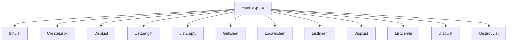
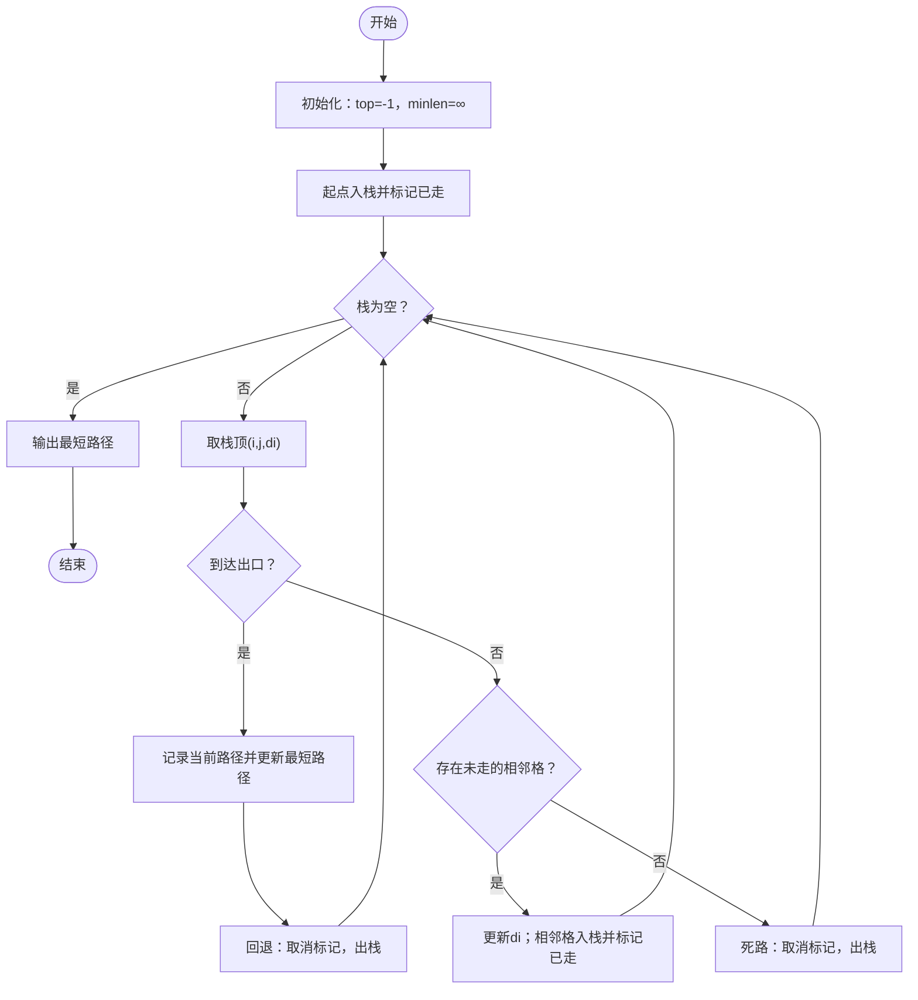
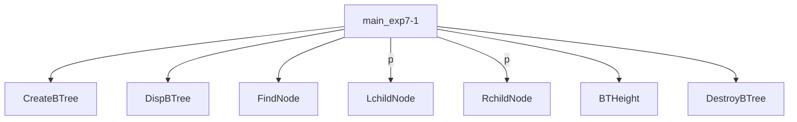
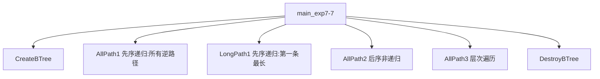
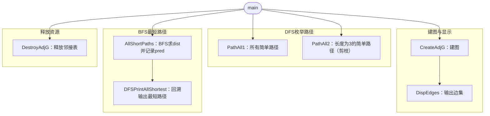
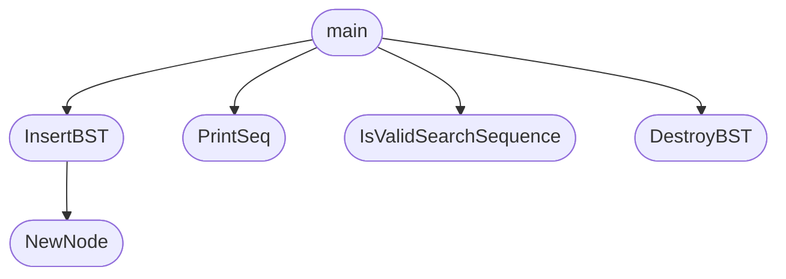
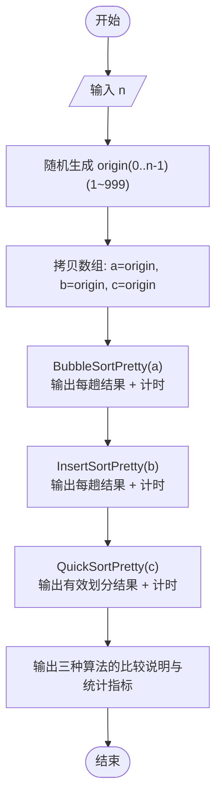
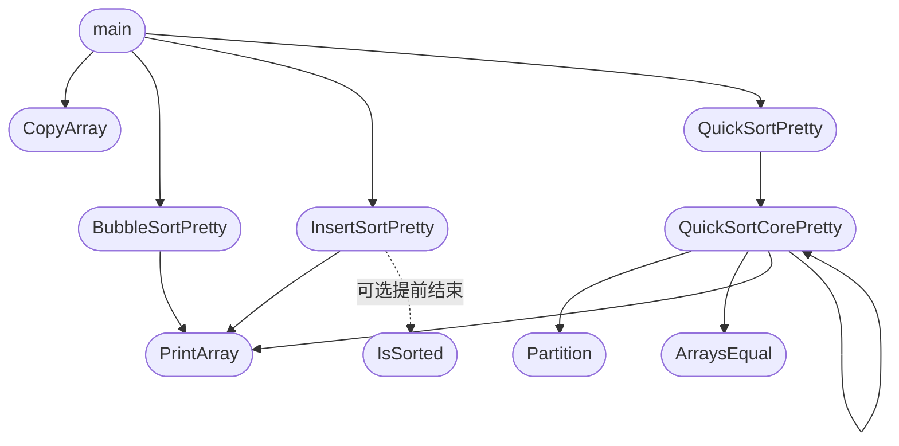

# 数据结构实验

### 实验一：线性表操作及其应用算法设计  

要求：有 3 个任务，一个必做实验，两个选做实验（任选其一）。  

#### 任务 1（必做）

实现循环单链表的各种基本运算的算法  实验内容：见主教材（第六版）第 74 页的实验题 4。  

1. **实验题 4：实现循环单链表的各种基本运算的算法**

   目的： 领会循环单链表的存储结构和掌握循环单链表中各种基本运算算法的设计。

   内容： 编写一个程序 `clinklist.cpp`，实现循环单链表的各种基本运算和整体链表算法（假设循环单链表的元素类型 `ElemType` 为 `int`），并在此基础上设计一个程序 `exp2-4.cpp` 完成以下功能：

   1. 初始化循环链表 h。
   2. 依次采用尾插法插入 a、b、c、d、e 元素。
   3. 输出循环链表 h。
   4. 输出循环链表 h 的长度。
   5. 判断循环链表 h 是否为空。
   6. 输出循环链表 h 的第 3 个元素。
   7. 输出元素 a 的位置。
   8. 在第 4 个元素的位置上插入 f 元素。
   9. 输出循环链表 h。
   10. 删除循环链表 h 的第 3 个元素。
   11. 输出循环链表 h。
   12. 释放循环单链表h。





#### 任务 2（选做）

用栈求解迷宫问题的所有路径及最短路径  实验内容：见主教材（第六版）第 118 页：实验题 5。

**实验题 5：用图求解迷宫问题的所有路径及最短路径**

目的： 掌握在求解迷宫问题中的应用。

**内容：** 编写一个程序 `exp3-5.cpp`，改进 3.1.4 节的求解迷宫问题程序，要求输出如图 3.28 所示的迷宫的所有路径，并求出第一条最短路径及其长度。





任务 3（选做）：编写停车场管理程序  实验内容：见主教材（第六版）第 119 页的实验题 9。  

### 实验二：二叉树的有关算法设计  

要求：有 3 个任务，一个必做实验，两个选做实验（任选其一）。  

#### 任务 1（必做）

实现二叉树的各种基本运算的算法。  实验内容：见主教材（第六版）第 243 页的实验题 1。  

实验题1：实现二叉树的各种基本运算的算法

目的：领会二叉链存储结构和掌握二叉树中基本运算算法的设计。

内容：编写一个程序 btree.cpp，实现二叉树的基本运算，并在此基础上设计一个程序 exp7-1.cpp 完成以下功能。

（1）由图 7.34 所示的二叉树创建对应的二叉链存储结构 b，该二叉树的括号表示串为

“A(B(D,E(H(J,K(L,M(,N))))),C(F,G(,I))”

（2）输出二叉树 b。

（3）输出 'H' 结点的左、右孩子结点信息。

（4）输出二叉树 b 的高度。

（5）释放二叉树 b。





任务 2（选做）：

求二叉树中两个结点的子孙关系（代际关系）。  实验内容：假设二叉树中的每个结点的值为单个字符且唯一，采用二叉链存储结 构存储，设计一个算法 int descendant (BTNode *b, char x, char y)，判断 值为 x 的结点是不是值为 y 的结点的子孙，若是，属于第几代子孙。算法函数返 回值说明：如果结点 x 不是结点 y 的子孙结点，或者二叉树中不存在 x 或不存在 y，该算法都返回零值，否则，返回一个正整数，表示结点 x 属于结点 y 的第几 代子孙。要求：编写一个程序，验证算法的正确性。  


#### 任务 3（选做）

求二叉树中从根结点到叶子结点的路径。  实验内容：见主教材（第六版）第 244 页的实验题 7。 

**实验题 7：求二叉树中从根结点到叶子结点的路径**

**目的：** 掌握二叉树遍历算法的应用，熟练使用先序、中序、后序递归和非递归遍历算法以及层次遍历算法进行二叉树问题的求解。

**内容：** 编写一个程序 exp7-7.cpp 实现以下功能，并对图 7.33 所示的二叉树进行验证。

（1）采用先序遍历方法输出所有从叶子结点到根结点的逆路径。
 （2）采用先序遍历方法输出第一条最长的逆路径。
 （3）采用后序非递归遍历方法输出所有从叶子结点到根结点的逆路径。
 （4）采用层次遍历方法输出所有从叶子结点到根结点的逆路径。




### 实验三：图的有关算法设计 

 要求：有 3 个任务，一个必做实验，两个选做实验（任选其一）。 

#### 任务 1（必做）

求有向图的简单路径  实验内容：见主教材（第六版）第 309 页实验题 10，要求：创建一个图，并输出 求得的路径。

 实验题 10：求有向图的简单路径

目的：掌握深度优先遍历和广度优先遍历算法在求解图路径问题中的应用。

内容：编写一个程序 exp8-10.cpp，设计相关算法完成以下功能。

（1）输出如图 8.56 所示的有向图 G 中从顶点 5 到顶点 2 的所有简单路径。

（2）输出如图 8.56 所示的有向图 G 中从顶点 5 到顶点 2 的所有长度为 3 的简单路径。

（3）输出如图 8.56 所示的有向图 G 中从顶点 5 到顶点 2 的最短路径。





#### 任务 2（选做）

：求解最短路径问题  实验内容：见主教材（第六版）第 311 页实验题 16。  

实验题 16：求解最短路径问题

目的：深入掌握 Dijkstra 算法在求解实际问题中的应用。

内容：编写一个程序 exp8-16.cpp，用来求解最短路径问题。假设有 n 个点，m 条无向边，每条边都有长度 d 和花费 p，给定起点 s 和终点 t，要求输出从起点到终点的最短距离及其花费。如果最短距离有多条路径线，则输出花费最少的。

测试数据存放在 data16.txt 文件中，第一行为 n,m，点的编号是 1～n；然后是 m 行，每行 4 个数 a,b,d,p，表示 a 和 b 之间有一条边，且其长度为 d，花费为 p；最后一行是两个数 s,t，表示起点 s 和终点 t。输出结果有两个数，分别表示最短距离及其花费。

例如，data16.txt 的数据如下：

32
1256
2345
13

答案是 9,11，表示最短距离为 9，对应的花费是 11。


任务 3（选做）：求解建公路问题  实验内容：见主教材（第六版）第 310 页实验题 14。 


### 实验四：查找与排序算法设计及应用  

#### （一）查找算法设计及其应用  

要求：两个选做实验（任选其一）。  

任务 1（选做）：折半查找算法的实现  要求：（1）用递归方法实现折半查找算法；（2）用折半查找方法求两个等长有序 序列的中位数（有关中位数的定义参见教材第 2 章中的例 2.17）。

  

任务 2（选做）：二叉排序树有关算法的实现  要求：编写一个程序，构造一棵二叉排序树 bt，判断一个序列 a 是否为二叉排 序树 bt 中一个合法的查找序列（从根结点出发的一条分支路径上的连续结点序列）。  





测试数据


#### （二）排序算法设计及其应用  

要求：两个选做实验（任选其一）。  

任务 1（选做）：不同排序算法的测试与比较  实验内容：编写一个程序，随机产生 n 个 1~999 的正整数序列，分别采用 3 种以上不同的排序算法对其进行递增排序，输出各趟的排序结果，并求出每种排序算法所需要的绝对时间。 








 

```
请输入 n（建议 <= 30，便于观察输出）：36

随机生成的序列（1~999）：
 284  27 906 315  21 899 513 190 803 465 279 913 986 209 497 928 669 761 895 213 247 543 980 329 370 993 667 657 737 694 386 351 736 530 328 925

冒泡排序:每趟结果（若某趟无交换则提前结束）：
初始： 284  27 906 315  21 899 513 190 803 465 279 913 986 209 497 928 669 761 895 213 247 543 980 329 370 993 667 657 737 694 386 351 736 530 328 925
第 1 趟：  27 284 315  21 899 513 190 803 465 279 906 913 209 497 928 669 761 895 213 247 543 980 329 370 986 667 657 737 694 386 351 736 530 328 925 993
第 2 趟：  27 284  21 315 513 190 803 465 279 899 906 209 497 913 669 761 895 213 247 543 928 329 370 980 667 657 737 694 386 351 736 530 328 925 986 993
第 3 趟：  27  21 284 315 190 513 465 279 803 899 209 497 906 669 761 895 213 247 543 913 329 370 928 667 657 737 694 386 351 736 530 328 925 980 986 993
第 4 趟：  21  27 284 190 315 465 279 513 803 209 497 899 669 761 895 213 247 543 906 329 370 913 667 657 737 694 386 351 736 530 328 925 928 980 986 993
第 5 趟：  21  27 190 284 315 279 465 513 209 497 803 669 761 895 213 247 543 899 329 370 906 667 657 737 694 386 351 736 530 328 913 925 928 980 986 993
第 6 趟：  21  27 190 284 279 315 465 209 497 513 669 761 803 213 247 543 895 329 370 899 667 657 737 694 386 351 736 530 328 906 913 925 928 980 986 993
第 7 趟：  21  27 190 279 284 315 209 465 497 513 669 761 213 247 543 803 329 370 895 667 657 737 694 386 351 736 530 328 899 906 913 925 928 980 986 993
第 8 趟：  21  27 190 279 284 209 315 465 497 513 669 213 247 543 761 329 370 803 667 657 737 694 386 351 736 530 328 895 899 906 913 925 928 980 986 993
第 9 趟：  21  27 190 279 209 284 315 465 497 513 213 247 543 669 329 370 761 667 657 737 694 386 351 736 530 328 803 895 899 906 913 925 928 980 986 993
第 10 趟：  21  27 190 209 279 284 315 465 497 213 247 513 543 329 370 669 667 657 737 694 386 351 736 530 328 761 803 895 899 906 913 925 928 980 986 993
第 11 趟：  21  27 190 209 279 284 315 465 213 247 497 513 329 370 543 667 657 669 694 386 351 736 530 328 737 761 803 895 899 906 913 925 928 980 986 993
第 12 趟：  21  27 190 209 279 284 315 213 247 465 497 329 370 513 543 657 667 669 386 351 694 530 328 736 737 761 803 895 899 906 913 925 928 980 986 993
第 13 趟：  21  27 190 209 279 284 213 247 315 465 329 370 497 513 543 657 667 386 351 669 530 328 694 736 737 761 803 895 899 906 913 925 928 980 986 993
第 14 趟：  21  27 190 209 279 213 247 284 315 329 370 465 497 513 543 657 386 351 667 530 328 669 694 736 737 761 803 895 899 906 913 925 928 980 986 993
第 15 趟：  21  27 190 209 213 247 279 284 315 329 370 465 497 513 543 386 351 657 530 328 667 669 694 736 737 761 803 895 899 906 913 925 928 980 986 993
第 16 趟：  21  27 190 209 213 247 279 284 315 329 370 465 497 513 386 351 543 530 328 657 667 669 694 736 737 761 803 895 899 906 913 925 928 980 986 993
第 17 趟：  21  27 190 209 213 247 279 284 315 329 370 465 497 386 351 513 530 328 543 657 667 669 694 736 737 761 803 895 899 906 913 925 928 980 986 993
第 18 趟：  21  27 190 209 213 247 279 284 315 329 370 465 386 351 497 513 328 530 543 657 667 669 694 736 737 761 803 895 899 906 913 925 928 980 986 993
第 19 趟：  21  27 190 209 213 247 279 284 315 329 370 386 351 465 497 328 513 530 543 657 667 669 694 736 737 761 803 895 899 906 913 925 928 980 986 993
第 20 趟：  21  27 190 209 213 247 279 284 315 329 370 351 386 465 328 497 513 530 543 657 667 669 694 736 737 761 803 895 899 906 913 925 928 980 986 993
第 21 趟：  21  27 190 209 213 247 279 284 315 329 351 370 386 328 465 497 513 530 543 657 667 669 694 736 737 761 803 895 899 906 913 925 928 980 986 993
第 22 趟：  21  27 190 209 213 247 279 284 315 329 351 370 328 386 465 497 513 530 543 657 667 669 694 736 737 761 803 895 899 906 913 925 928 980 986 993
第 23 趟：  21  27 190 209 213 247 279 284 315 329 351 328 370 386 465 497 513 530 543 657 667 669 694 736 737 761 803 895 899 906 913 925 928 980 986 993
第 24 趟：  21  27 190 209 213 247 279 284 315 329 328 351 370 386 465 497 513 530 543 657 667 669 694 736 737 761 803 895 899 906 913 925 928 980 986 993
第 25 趟：  21  27 190 209 213 247 279 284 315 328 329 351 370 386 465 497 513 530 543 657 667 669 694 736 737 761 803 895 899 906 913 925 928 980 986 993
第 26 趟：  21  27 190 209 213 247 279 284 315 328 329 351 370 386 465 497 513 530 543 657 667 669 694 736 737 761 803 895 899 906 913 925 928 980 986 993
（本趟无交换，排序已完成，提前结束）
结果：  21  27 190 209 213 247 279 284 315 328 329 351 370 386 465 497 513 530 543 657 667 669 694 736 737 761 803 895 899 906 913 925 928 980 986 993
趟数=26, 比较次数=585, 交换次数=270, 用时=31.000 ms

直接插入排序:每趟结果：
初始： 284  27 906 315  21 899 513 190 803 465 279 913 986 209 497 928 669 761 895 213 247 543 980 329 370 993 667 657 737 694 386 351 736 530 328 925
第 1 趟：  27 284 906 315  21 899 513 190 803 465 279 913 986 209 497 928 669 761 895 213 247 543 980 329 370 993 667 657 737 694 386 351 736 530 328 925
第 2 趟：  27 284 906 315  21 899 513 190 803 465 279 913 986 209 497 928 669 761 895 213 247 543 980 329 370 993 667 657 737 694 386 351 736 530 328 925
（本趟无需移动元素）
第 3 趟：  27 284 315 906  21 899 513 190 803 465 279 913 986 209 497 928 669 761 895 213 247 543 980 329 370 993 667 657 737 694 386 351 736 530 328 925
第 4 趟：  21  27 284 315 906 899 513 190 803 465 279 913 986 209 497 928 669 761 895 213 247 543 980 329 370 993 667 657 737 694 386 351 736 530 328 925
第 5 趟：  21  27 284 315 899 906 513 190 803 465 279 913 986 209 497 928 669 761 895 213 247 543 980 329 370 993 667 657 737 694 386 351 736 530 328 925
第 6 趟：  21  27 284 315 513 899 906 190 803 465 279 913 986 209 497 928 669 761 895 213 247 543 980 329 370 993 667 657 737 694 386 351 736 530 328 925
第 7 趟：  21  27 190 284 315 513 899 906 803 465 279 913 986 209 497 928 669 761 895 213 247 543 980 329 370 993 667 657 737 694 386 351 736 530 328 925
第 8 趟：  21  27 190 284 315 513 803 899 906 465 279 913 986 209 497 928 669 761 895 213 247 543 980 329 370 993 667 657 737 694 386 351 736 530 328 925
第 9 趟：  21  27 190 284 315 465 513 803 899 906 279 913 986 209 497 928 669 761 895 213 247 543 980 329 370 993 667 657 737 694 386 351 736 530 328 925
第 10 趟：  21  27 190 279 284 315 465 513 803 899 906 913 986 209 497 928 669 761 895 213 247 543 980 329 370 993 667 657 737 694 386 351 736 530 328 925
第 11 趟：  21  27 190 279 284 315 465 513 803 899 906 913 986 209 497 928 669 761 895 213 247 543 980 329 370 993 667 657 737 694 386 351 736 530 328 925
（本趟无需移动元素）
第 12 趟：  21  27 190 279 284 315 465 513 803 899 906 913 986 209 497 928 669 761 895 213 247 543 980 329 370 993 667 657 737 694 386 351 736 530 328 925
（本趟无需移动元素）
第 13 趟：  21  27 190 209 279 284 315 465 513 803 899 906 913 986 497 928 669 761 895 213 247 543 980 329 370 993 667 657 737 694 386 351 736 530 328 925
第 14 趟：  21  27 190 209 279 284 315 465 497 513 803 899 906 913 986 928 669 761 895 213 247 543 980 329 370 993 667 657 737 694 386 351 736 530 328 925
第 15 趟：  21  27 190 209 279 284 315 465 497 513 803 899 906 913 928 986 669 761 895 213 247 543 980 329 370 993 667 657 737 694 386 351 736 530 328 925
第 16 趟：  21  27 190 209 279 284 315 465 497 513 669 803 899 906 913 928 986 761 895 213 247 543 980 329 370 993 667 657 737 694 386 351 736 530 328 925
第 17 趟：  21  27 190 209 279 284 315 465 497 513 669 761 803 899 906 913 928 986 895 213 247 543 980 329 370 993 667 657 737 694 386 351 736 530 328 925
第 18 趟：  21  27 190 209 279 284 315 465 497 513 669 761 803 895 899 906 913 928 986 213 247 543 980 329 370 993 667 657 737 694 386 351 736 530 328 925
第 19 趟：  21  27 190 209 213 279 284 315 465 497 513 669 761 803 895 899 906 913 928 986 247 543 980 329 370 993 667 657 737 694 386 351 736 530 328 925
第 20 趟：  21  27 190 209 213 247 279 284 315 465 497 513 669 761 803 895 899 906 913 928 986 543 980 329 370 993 667 657 737 694 386 351 736 530 328 925
第 21 趟：  21  27 190 209 213 247 279 284 315 465 497 513 543 669 761 803 895 899 906 913 928 986 980 329 370 993 667 657 737 694 386 351 736 530 328 925
第 22 趟：  21  27 190 209 213 247 279 284 315 465 497 513 543 669 761 803 895 899 906 913 928 980 986 329 370 993 667 657 737 694 386 351 736 530 328 925
第 23 趟：  21  27 190 209 213 247 279 284 315 329 465 497 513 543 669 761 803 895 899 906 913 928 980 986 370 993 667 657 737 694 386 351 736 530 328 925
第 24 趟：  21  27 190 209 213 247 279 284 315 329 370 465 497 513 543 669 761 803 895 899 906 913 928 980 986 993 667 657 737 694 386 351 736 530 328 925
第 25 趟：  21  27 190 209 213 247 279 284 315 329 370 465 497 513 543 669 761 803 895 899 906 913 928 980 986 993 667 657 737 694 386 351 736 530 328 925
（本趟无需移动元素）
第 26 趟：  21  27 190 209 213 247 279 284 315 329 370 465 497 513 543 667 669 761 803 895 899 906 913 928 980 986 993 657 737 694 386 351 736 530 328 925
第 27 趟：  21  27 190 209 213 247 279 284 315 329 370 465 497 513 543 657 667 669 761 803 895 899 906 913 928 980 986 993 737 694 386 351 736 530 328 925
第 28 趟：  21  27 190 209 213 247 279 284 315 329 370 465 497 513 543 657 667 669 737 761 803 895 899 906 913 928 980 986 993 694 386 351 736 530 328 925
第 29 趟：  21  27 190 209 213 247 279 284 315 329 370 465 497 513 543 657 667 669 694 737 761 803 895 899 906 913 928 980 986 993 386 351 736 530 328 925
第 30 趟：  21  27 190 209 213 247 279 284 315 329 370 386 465 497 513 543 657 667 669 694 737 761 803 895 899 906 913 928 980 986 993 351 736 530 328 925
第 31 趟：  21  27 190 209 213 247 279 284 315 329 351 370 386 465 497 513 543 657 667 669 694 737 761 803 895 899 906 913 928 980 986 993 736 530 328 925
第 32 趟：  21  27 190 209 213 247 279 284 315 329 351 370 386 465 497 513 543 657 667 669 694 736 737 761 803 895 899 906 913 928 980 986 993 530 328 925
第 33 趟：  21  27 190 209 213 247 279 284 315 329 351 370 386 465 497 513 530 543 657 667 669 694 736 737 761 803 895 899 906 913 928 980 986 993 328 925
第 34 趟：  21  27 190 209 213 247 279 284 315 328 329 351 370 386 465 497 513 530 543 657 667 669 694 736 737 761 803 895 899 906 913 928 980 986 993 925
第 35 趟：  21  27 190 209 213 247 279 284 315 328 329 351 370 386 465 497 513 530 543 657 667 669 694 736 737 761 803 895 899 906 913 925 928 980 986 993
结果：  21  27 190 209 213 247 279 284 315 328 329 351 370 386 465 497 513 530 543 657 667 669 694 736 737 761 803 895 899 906 913 925 928 980 986 993
趟数=35, 比较次数=303, 移动次数=270, 用时=42.000 ms

快速排序:每次有效划分结果：
初始： 284  27 906 315  21 899 513 190 803 465 279 913 986 209 497 928 669 761 895 213 247 543 980 329 370 993 667 657 737 694 386 351 736 530 328 925
第 1 次划分： 247  27 213 209  21 279 190 284 803 465 513 913 986 899 497 928 669 761 895 315 906 543 980 329 370 993 667 657 737 694 386 351 736 530 328 925
第 2 次划分： 190  27 213 209  21 247 279 284 803 465 513 913 986 899 497 928 669 761 895 315 906 543 980 329 370 993 667 657 737 694 386 351 736 530 328 925
第 3 次划分：  21  27 190 209 213 247 279 284 803 465 513 913 986 899 497 928 669 761 895 315 906 543 980 329 370 993 667 657 737 694 386 351 736 530 328 925
第 4 次划分：  21  27 190 209 213 247 279 284 328 465 513 530 736 351 497 386 669 761 694 315 737 543 657 329 370 667 803 993 980 906 895 928 899 986 913 925
第 5 次划分：  21  27 190 209 213 247 279 284 315 328 513 530 736 351 497 386 669 761 694 465 737 543 657 329 370 667 803 993 980 906 895 928 899 986 913 925
第 6 次划分：  21  27 190 209 213 247 279 284 315 328 370 329 465 351 497 386 513 761 694 669 737 543 657 736 530 667 803 993 980 906 895 928 899 986 913 925
第 7 次划分：  21  27 190 209 213 247 279 284 315 328 351 329 370 465 497 386 513 761 694 669 737 543 657 736 530 667 803 993 980 906 895 928 899 986 913 925
第 8 次划分：  21  27 190 209 213 247 279 284 315 328 329 351 370 465 497 386 513 761 694 669 737 543 657 736 530 667 803 993 980 906 895 928 899 986 913 925
第 9 次划分：  21  27 190 209 213 247 279 284 315 328 329 351 370 386 465 497 513 761 694 669 737 543 657 736 530 667 803 993 980 906 895 928 899 986 913 925
第 10 次划分：  21  27 190 209 213 247 279 284 315 328 329 351 370 386 465 497 513 667 694 669 737 543 657 736 530 761 803 993 980 906 895 928 899 986 913 925
第 11 次划分：  21  27 190 209 213 247 279 284 315 328 329 351 370 386 465 497 513 530 657 543 667 737 669 736 694 761 803 993 980 906 895 928 899 986 913 925
第 12 次划分：  21  27 190 209 213 247 279 284 315 328 329 351 370 386 465 497 513 530 543 657 667 737 669 736 694 761 803 993 980 906 895 928 899 986 913 925
第 13 次划分：  21  27 190 209 213 247 279 284 315 328 329 351 370 386 465 497 513 530 543 657 667 694 669 736 737 761 803 993 980 906 895 928 899 986 913 925
第 14 次划分：  21  27 190 209 213 247 279 284 315 328 329 351 370 386 465 497 513 530 543 657 667 669 694 736 737 761 803 993 980 906 895 928 899 986 913 925
第 15 次划分：  21  27 190 209 213 247 279 284 315 328 329 351 370 386 465 497 513 530 543 657 667 669 694 736 737 761 803 925 980 906 895 928 899 986 913 993
第 16 次划分：  21  27 190 209 213 247 279 284 315 328 329 351 370 386 465 497 513 530 543 657 667 669 694 736 737 761 803 913 899 906 895 925 928 986 980 993
第 17 次划分：  21  27 190 209 213 247 279 284 315 328 329 351 370 386 465 497 513 530 543 657 667 669 694 736 737 761 803 895 899 906 913 925 928 986 980 993
第 18 次划分：  21  27 190 209 213 247 279 284 315 328 329 351 370 386 465 497 513 530 543 657 667 669 694 736 737 761 803 895 899 906 913 925 928 980 986 993
结果：  21  27 190 209 213 247 279 284 315 328 329 351 370 386 465 497 513 530 543 657 667 669 694 736 737 761 803 895 899 906 913 925 928 980 986 993
有效划分次数=18, 比较次数=161, 移动次数=84, 用时=16.000 ms

比较说明:
1）冒泡：若某趟无交换则提前结束；一般交换多、效率低。
2）插入：趟数通常为 n-1，但当序列接近有序时移动次数很少。
3）快排：递归分区，平均效率高；本程序只输出有效划分避免冗余。

--------------------------------
Process exited after 2.41 seconds with return value 0
请按任意键继续. . .
```


```
请输入 n（建议 <= 30，便于观察输出）：100

随机生成的序列（1~999）：
 542 180 155 773 668 215  38 309 294 293 582 397 466 645 190 375 359 575 663 677 552 132 510 423 132 890 886 507 752 487  93 984 163 723 772 594 547 660 915 637 378 139 208 440 336 143 438 226 193 230 293 816   6 467  81 195 329  74 673 746 591 217 628 214 928 981 589 179 644 125 910 108 572 259  10 571 703 476 995 283 989 849 276 963 447 216  84 459 281 494 243 956 972 344 695 891  31 585 518 395

冒泡排序:（若某趟无交换则提前结束）：
趟数=95, 比较次数=4940, 交换次数=2340, 用时=240.000 ms


直接插入排序:
趟数=99, 比较次数=2435, 移动次数=2340, 用时=391.000 ms

快速排序:
有效划分次数=48, 比较次数=616, 移动次数=283, 用时=193.000 ms

比较说明:
1）冒泡：若某趟无交换则提前结束；一般交换多、效率低。
2）插入：趟数通常为 n-1，但当序列接近有序时移动次数很少。
3）快排：递归分区，平均效率高；本程序只输出有效划分避免冗余。
```


任务 2（选做）：排序算法设计及应用  比如：对世界各国新冠肺炎病例数进行排序：针对某一天的世界各国新冠肺炎疫 情数据（参考附件），对累计确诊病例数排名靠前的 100 个国家（包括中国）的 新增确诊、累计治愈和死亡病例数、治愈率和病死率分别进行排序，要求：采用 三种以上不同的排序方法来实现，并输出排序后的国家名和相应的病例数。 

